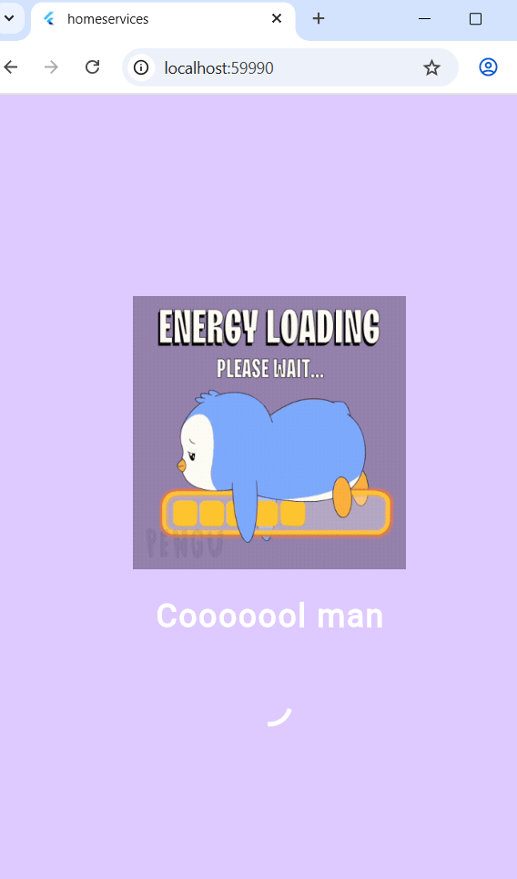
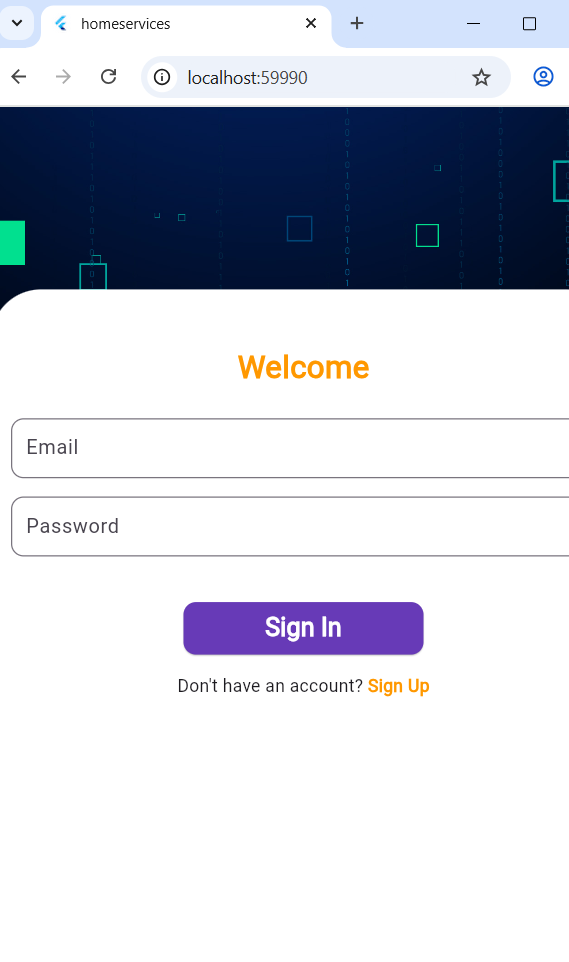
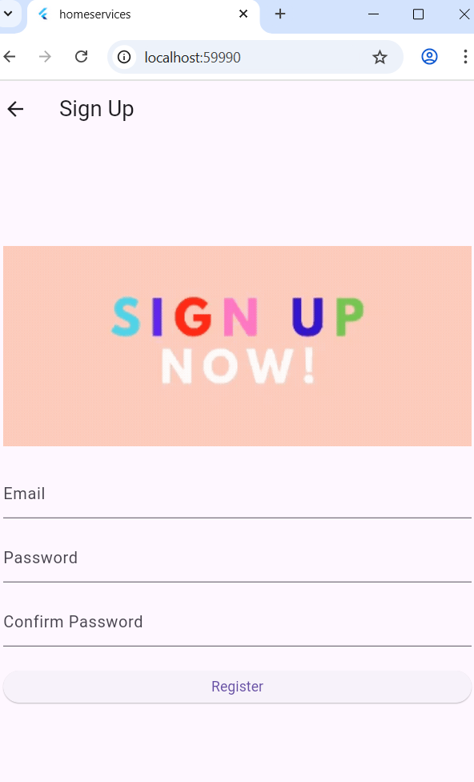
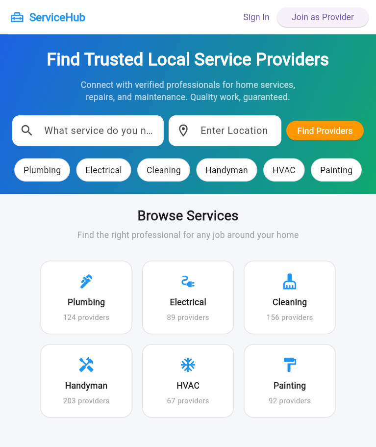
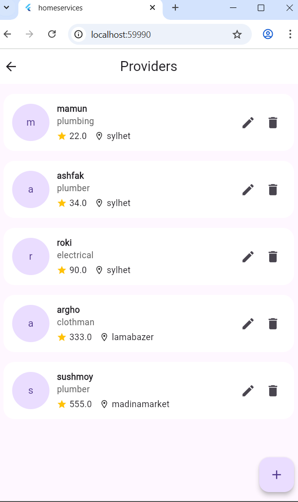
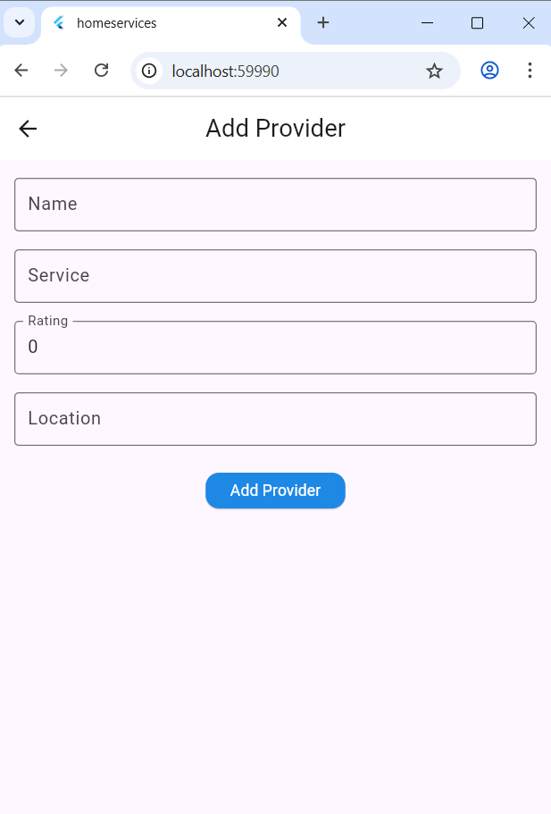

# Home Service App

This is a simple Flutter project where users can register, login, and use home service features.  
The app includes **Splash Screen, Login, Registration, Home, and Provider Management pages**.

---

## 📱 Screenshots  

### 1️⃣ Splash Page  

---

### 2️⃣ Login Page  

---

### 3️⃣ Registration Page  
If you don’t have an account, you can create one.  

---

### 4️⃣ Home Page  

---
### 5️⃣ Provider List  
As a user joins as a provider:  

---

### 6️⃣ Add Provider  
Add name & occupation:  

## 🚀 Features
- Splash screen at startup  
- User login and registration  
- Home page dashboard  
- Add provider with name & occupation  
- View provider list  

---

## 🛠️ Tech Stack

- **Flutter**  
- **Dart**  
- **Superbase** 

---

